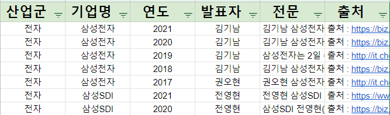
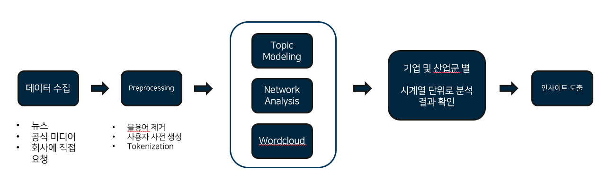
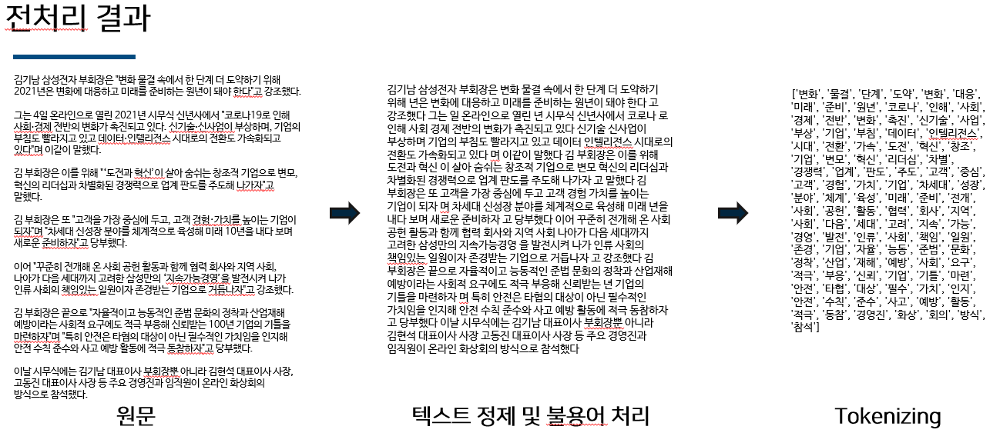

# new_year_speech - 2021-2 비정형데이터 조별 프로젝트

## Researcher : 김종백, 정주현, 박순혁

## Topic

동일 산업군 내 기업들의 최대 5년간 신년사를 네트워크 분석 및 워드클라우드로 Topic Modeling하여 기업의 주요 관심사의 변화를 파악하는 한편 동시대별 기업 및 산업군을 비교/대조하여 분석

## Data

- 총 12개 산업군 / 42개 기업에 대해 2017~2021 신년사를 수집
- 전문 데이터는 신년사 전문을 우선으로 하고, 부족 시 기사 요약으로 구성됨
- 총 198개의 신년사 데이터 확보




----------------

## Research Process



## Preprocessing


### 정규식을 활용한 전처리

```python
# 정규식 전처리
def clean_text(text):    
    
    pattern='(\[a-zA-Z0-9\_.+-\]+@\[a-zA-Z0-9]+.\[a-zA-Z0-9-.\]+)' # email제거
    text=re.sub(pattern=pattern,repl=' ',string=text)
    
    text = text.upper()
    
    pattern = '([ㄱ-ㅎㅏ-ㅣ])+' # 한글 자음, 모음 제거
    text=re.sub(pattern=pattern,repl=' ',string=text)
    
    pattern=re.compile(r'([^\w]?\d+\.?\,?\)?\d*)+') # 숫자 제거
    text=re.sub(pattern=pattern,repl=' ',string=text)
    
    pattern='<[^>]*>' # html 태그 제거
    text=re.sub(pattern=pattern,repl=' ',string=text)
    
    pattern='[\r|\n]' # \r,\n 제거
    text=re.sub(pattern=pattern,repl=' ',string=text)
    
    pattern= '[^\w\s]' # 특수기호 제거
    text=re.sub(pattern=pattern,repl=' ',string=text)
    
    pattern=re.compile(r'\s+')  #  이중 space 제거
    text=re.sub(pattern=pattern,repl=' ',string=text)

#     hangul = re.compile('[^ ㄱ-ㅣ가-힣]+') # 한글과 띄어쓰기를 제외한 모든 글자
#     text=re.sub(pattern=hangul,repl=' ',string=text) # 한글과 띄어쓰기를 제외한 모든 부분을 제거
    
    text=text.strip()
    return text
```

### 사용자 사전 생성

```python
##사용자 사전 추가하기
komoran_userdic=Komoran(userdic='./userdic_speech.txt')

#불용어에 발표자,기업이름도 넣음
SW = ['사장님','사장','임직원','사진','그럼에도 불구하고','정유', '이날', '시무식', '대표', '이사','부회장',
      '김현석','고동진', '온라인','해로', '지난해', '올해', '사자성', '당부','오전','경기', '수원', '삼성', '포스트',
      '전영', '신년', '신년사', '창립', '주년', '경기도', '엠블럼','가지', '회장', '더 가까이', '여러분', '안녕하십니까',
      '새해', '발표', '포로', '정호', '구성원', '현대자동차그룹','해주시', '앞으로', '그룹', '나가야', '경자', '니다',
      '오늘','내일', '현대백화점그룹', 'SK텔레콤', 'SK브로드밴드', 'LG CNS', '대로', '모두', '감사', '가족', '친애',
      '흰 소', '신축년', '사랑', '기해','돼지', '힘찬','만큼', '선도해', '주시', '은행장', '출처', '신아일보', '신한',
      '너머','고맙습니다', '행복', '약속', '모아', 'ON', '하나금융그룹', '마리', '직원', '한마음', '다운', '뉴스',
      '다보스', '농협', 'NH농협은행','가지', '가슴', '호시','여럿','폴리스','기적을','때문','가와', '장이','자리',
      '이병', '사와', '시상', '하나로', '발짝', '여명', '투데이', '신문',' 작성', '기사', '종수','열자', '승호', '우선시',
      '국민','장한', '보령', '제약','SK이노베이션','무술','허진','GS칼텍스','한해','예년','라고','한진그룹','현대중공업그룹',
      '반갑습니다', '동안','별도','근간','메시지','마무리','대림','곳곳','가교','스키','팍스','아무것','금년','강조',
      '기원','노고','가정','건강','작년','마지막','전문','한편','마음','가운데','최근','정도','향후','자랑','그동안',
      '다짐','아침','목소리','중앙은행','행위','기쁨','명심'
     ]  + \
```

### Tokenizing

```python
def text_tokenizing(corpus, tokenizer):
    token_corpus = []

    if tokenizer == "noun":
        for n in tqdm_notebook(range(len(corpus)), desc="Preprocessing"):
            token_text = komoran_userdic.nouns(corpus[n])
            token_text = [word for word in token_text if word not in SW and len(word) > 1]
            token_corpus.append(token_text)

    elif tokenized == "morph":
        for n in tqdm_notebook(range(len(corpus)), desc="Preprocessing"):
            token_text = komoran_userdic.nouns(corpus[n])
            token_text = [word for word in token_text if word not in SW and len(word) > 1]
            token_corpus.append(token_text)

    elif tokenizer == "word":
        for n in tqdm_notebook(range(len(corpus)), desc="Preprocessing"):
            token_text = corpus[n].split()
            token_text = [word for word in token_text if word not in SW and len(word) > 1]
            token_corpus.append(token_text)

        
    return token_corpus
```



## Wordcloud

- 연도별, 산업군별, 기업별로 각각 진행

## Graph Analysis

- 연도별, 산업군별, 기업별로 각각 진행

## Conclusion

- 추후 작성 예정
